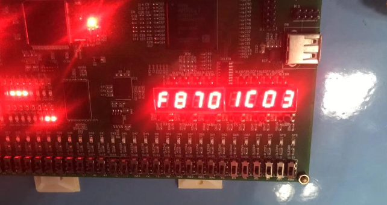
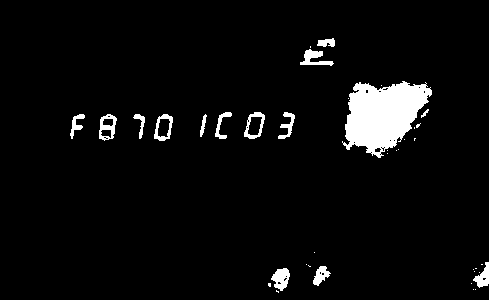
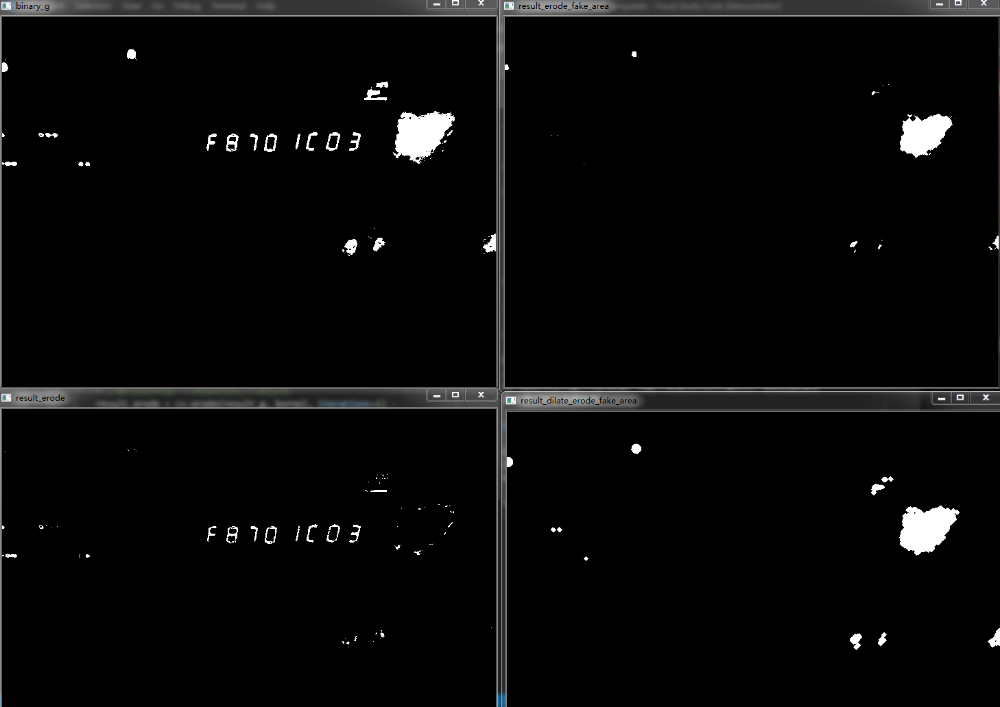

# 想法

如果要使用传统的方法来识别数码管，涉及到很多参数的设置与调试，鲁棒性不强，尤其是在灰度化和二值化的时候，参数设置很关键。


# 算法

1. 预处理获得二值化图片

2. 使用切割方法切割出数字部分

---

## 预处理

### 二值化图片获取

#### 噪音处理

- 问题

    + 反光会形成较大光斑

        

        

        

#### 数字分割

- 寻找轮廓


- 轮廓排序


- 图片分割


---- 


# 识别部分算法

----

# **模板匹配(Template Matching)算法**

模板匹配（Template Matching）是图像识别中最具代表性的方法之一。它从待识别图像中提取若干特征向量与模板对应的特征向量进行比较，计算图像与模板特征向量之间的距离，用最小距离法判定所属类别。模板匹配通常事先建立好标准模板库。

## 简单计算样本之间距离的方法

循环计算待测样本和训练集中已知样本之间的距离，比较所有的距离值，找出与待测样本最近的已知样品，其中所对应的样本所属的类别就是待测样本X所属的类别。

c实现代码如下：
```C
/****************************************
*参数：
*   src:待匹配特征向量
*   template:模板向量
*返回值：
*   int:返回匹配结果；-1：无匹配项
*意义：
*   输入待匹配特征向量，输出匹配结果
    *****************************************/

#define NFeature 25 //特征个数
#define NSample  10 //样本个数
int templateMatching(double src[], double template[][NFeature])
{
   double d[11] = {0.0}, temp, mind = 10.0; //匹配度
   int flag = -1, i, j;

   for(j = 0; j < NSample; j++) {
        for(i = 0; i < NFeature; i++) {
                // pow(x,y): x的y次方
                temp = pow(src[i] - template[j][i], 2);
                d[j] += temp;
        }
        d[j] = sqrt(d[j]);

        if(mind > d[j]) {
            mind = d[j];
            flag = j;            
        }
   }

   return flag;
}
————————————————
版权声明：本文为CSDN博主「ZachZheng」的原创文章，遵循 CC 4.0 BY-SA 版权协议，转载请附上原文出处链接及本声明。
原文链接：https://blog.csdn.net/zhi_neng_zhi_fu/article/details/51029864

```
- 不足之处

    以上算法有一个很大的问题，就是当特征向量值顺序改变之后，计算结果有很大的变化。
    
    例如:     
    B = {1, 2, 3, 4}; A1 = {4, 3, 2, 1}; A2 = {1，2，3，4}。    
    A1与B匹配，结果为{3*3+1*1+1*1+3*3} = 20;A2与B匹配，结果为{0+0+0+0} = 0；很明显特征向量A1与A2是相同的，在实际图像识别过程中有可能造成：一个图像旋转了一定角度，就无法识别出来。所以，这个算法只适合同方向的物体匹配，例如车牌字符识别等。

总结:

1. 只适合恒定方向特征匹配,例如车牌中的字符特征匹配

可用

## Hausdorff 距离匹配

Hausdorff是描述两组点之间相似程度的一种度量，它是集合和集合之间距离的一种定义形式。下面我们慢慢讲解Hausdorff算法的过程。

- 点到点集的距离

- A集合到B集合的直接Hausdorff距离


还是以上面的例子为例来说明。例如：B = {1， 2， 3， 4}， A1 = {4， 3， 2， 1}， A2 = {1 ，2， 3， 4}；A1与B匹配：Max{0, 0} = 0; A2与B的匹配:Max{0, 0} = 0;可以看到匹配的结果是：A1与A2是相同的，即使他们特征元素的顺序打乱了。一样可以把他们都正确匹配出来。

下面按照最一般的情况，计算待测特征向量X与某一样本T的匹配度。特征元素为有理数。

```C
/*******************************************************
 *参数：
    X：输入特征向量数组
    T：模板库中某一样本特征向量
    n: 特征向量个数
  返回值：
    返回匹配结果
  函数意义：
    通过输入待测特征向量和模板特征向量，计算出待测特征向量
  的匹配度，数值越小，匹配程度越高。式中的距离范式是特征元素
  之间的差值绝对值。    
    ***************************************************/
double charrecognize(double X[], double T[], int n) 
{
    int i，j;
    double d[2] = {0.0};//存储X-->T的Hausdorff和T-->X的Hausdorff值
    double minTemp = 1000.0, sum;

    //计算X-->T的Hausdoff值
    for(i = 0; i < n; i++) {
        minTemp = 1000.0;
        for(j = 0; j < n; j++) {
            //fabs(x)求浮点数x的绝对值
            sum = fabs(X[i] - T[j]);
            if(sum < minTemp)
                minTemp = sum;      
        }
        d[0] += minTemp;        
    }

    //计算T-->X的Hausdorff值
    for(j = 0; j < n; j++) {
        minTemp = 1000.0;
        for(i = 0; i < n; i++) {
            sum = fabs(T[j] - X[i]);
            if(sum < minTemp)
                minTemp = sum;
        }
        d[1] += minTemp;        
    }

    //返回较大值
    if(d[0] > d[1])
        return d[0];
    return d[1];
}
————————————————
版权声明：本文为CSDN博主「ZachZheng」的原创文章，遵循 CC 4.0 BY-SA 版权协议，转载请附上原文出处链接及本声明。
原文链接：https://blog.csdn.net/zhi_neng_zhi_fu/article/details/51029864
```
当我们匹配要求特定方向、特定位置的图片时，其实也可以用Hausdorff距离进行特征匹配。


## 多目标匹配

利用opencv进行多目标模板匹配，只要是利用其matchTemplate函数，但在多目标（这里是讨论目标图片中不同大小模板的匹配），以下贴出代码和图片，供大家参考：

```python
import cv2 as cv
import numpy as np

def template():
    #模板图片
    tpl=cv.imread('12tem.jpg')
    #目标图片
    target=cv.imread('12.jpg')
    cv.imshow('template',tpl)
    cv.imshow('target',target)

    methods=[cv.TM_SQDIFF_NORMED,cv.TM_CCORR_NORMED,cv.TM_CCOEFF_NORMED]

    #获得模板的高宽
    th,tw=tpl.shape[:2]
    for md in methods:
        #执行模板匹配
        #target：目标图片
        #tpl：模板图片
        #匹配模式
        result=cv.matchTemplate(target,tpl,md)
        #寻找矩阵(一维数组当作向量,用Mat定义)中最小值和最大值的位置
        min_val,max_val,min_loc,max_loc=cv.minMaxLoc(result)
        if md==cv.TM_SQDIFF_NORMED:
            tl=min_loc
        else:
            tl=max_loc

        br=(tl[0]+tw,tl[1]+th)
        #绘制矩形边框，将匹配区域标注出来
        #target：目标图像
        #tl：矩形定点
        #br：举行的宽高
        #(0,0,255)：矩形边框颜色
        #2：矩形边框大小
        cv.rectangle(target,tl,br,(0,0,255),2)
        cv.imshow('match-'+np.str(md),target)


template();

cv.waitKey(0)
cv.destroyAllWindows()
``` 